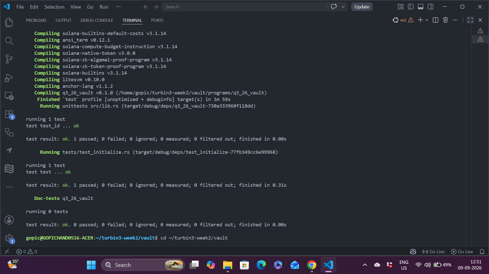

# Vault Program - Turbin3 Q3 2026

Personal SOL vault program written in Anchor for the Turbin3 Builders Cohort (Week 2 Assignment).

This program lets a user create a personal vault using PDAs, deposit SOL, withdraw SOL, and close the vault while reclaiming rent.

---

## What Was Implemented

### Instructions

| Instruction   | Status | Description |
|---------------|--------|-----------|
| `initialize`  | Done   | Creates `VaultState` PDA and the vault System Account |
| `deposit`     | Done   | Transfers SOL from user to the vault PDA |
| `withdraw`    | Done   | Transfers SOL from vault PDA back to user using PDA signer seeds |
| `close`       | Done   | Transfers remaining lamports and closes the `VaultState` account |

### Key Technical Details

- Used Program Derived Addresses (PDAs) for both the state and the vault
- Stored both `state_bump` and `vault_bump` inside `VaultState`
- Withdraw and Close use `CpiContext::new_with_signer` so the vault PDA can sign the System Program transfer
- Close instruction uses Anchor's `close = user` constraint
- Custom error for invalid amount (`ErrorCode::InvalidAmount`)

---

## Account Structure

### VaultState PDA
- Seeds: `[b"state", user.key().as_ref()]`
- Stores:
  - `vault_bump: u8`
  - `state_bump: u8`

### Vault PDA
- Seeds: `[b"vault", user.key().as_ref()]`
- Type: `SystemAccount`
- Holds the actual SOL balance

---

## How Withdraw Works

Because the vault is a PDA, the program must sign on behalf of the vault:

```rust
let seeds = &[
    VAULT_SEED,
    self.user.key.as_ref(),
    &[self.vault_state.vault_bump],
];
let signer_seeds = &[&seeds[..]];

let cpi_ctx = CpiContext::new_with_signer(
    self.system_program.key(),
    Transfer {
        from: self.vault.to_account_info(),
        to: self.user.to_account_info(),
    },
    signer_seeds,
);
```

---

## Testing

All instructions are covered in a single LiteSVM integration test.

Test flow:
1. Initialize the vault
2. Deposit 0.5 SOL
3. Withdraw 0.1 SOL
4. Close the vault

### Run Tests

```bash
anchor build
anchor test
```

All tests are currently passing.

---

## Project Structure

```
programs/q3_26_vault/
├── src/
│   ├── instructions/
│   │   ├── initialize.rs
│   │   ├── deposit.rs
│   │   ├── withdraw.rs
│   │   └── close.rs
│   ├── constants.rs
│   ├── error.rs
│   ├── state.rs
│   └── lib.rs
└── tests/
    └── test_initialize.rs
```

---

## Test Result



## Program ID

```
Cx3C4HVsWYJQqNKcEyUFtqVnoMNzcRoZz81zLYissi1G
```

---

## Author

Gopichand 
Turbin3 Builders Cohort - Q3 2026
